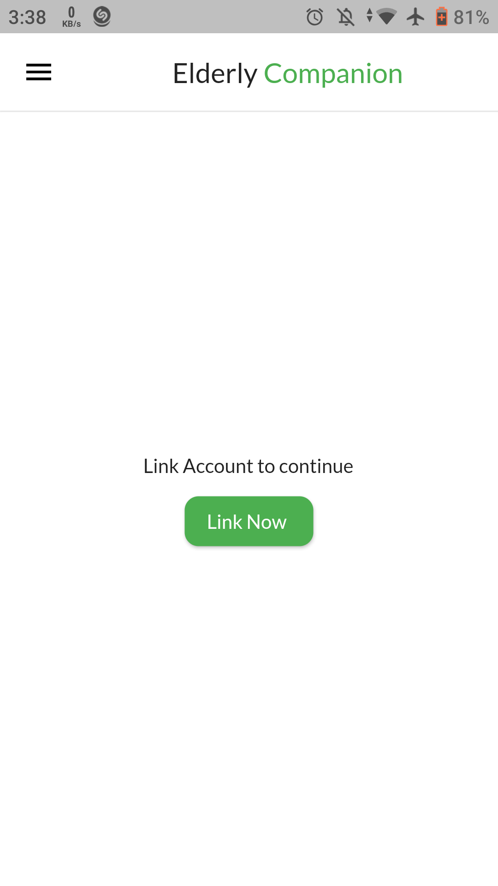
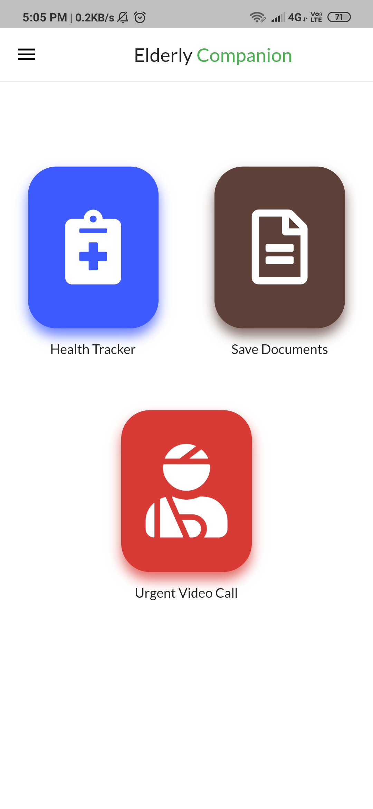
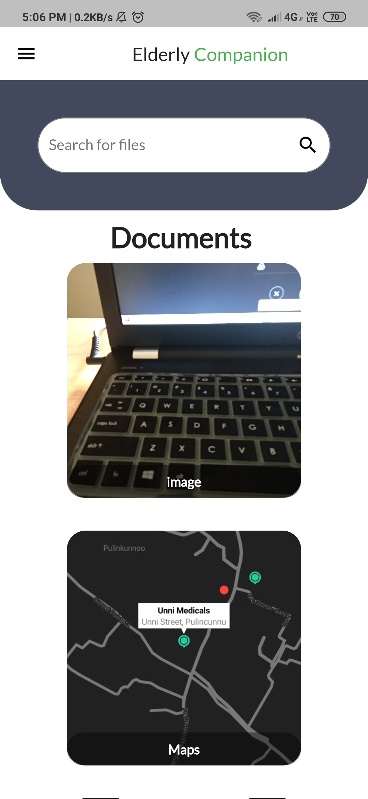
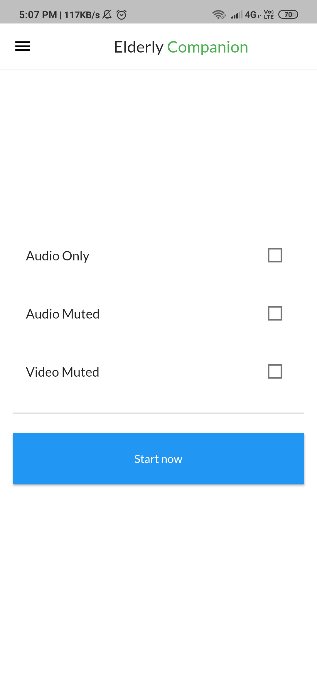
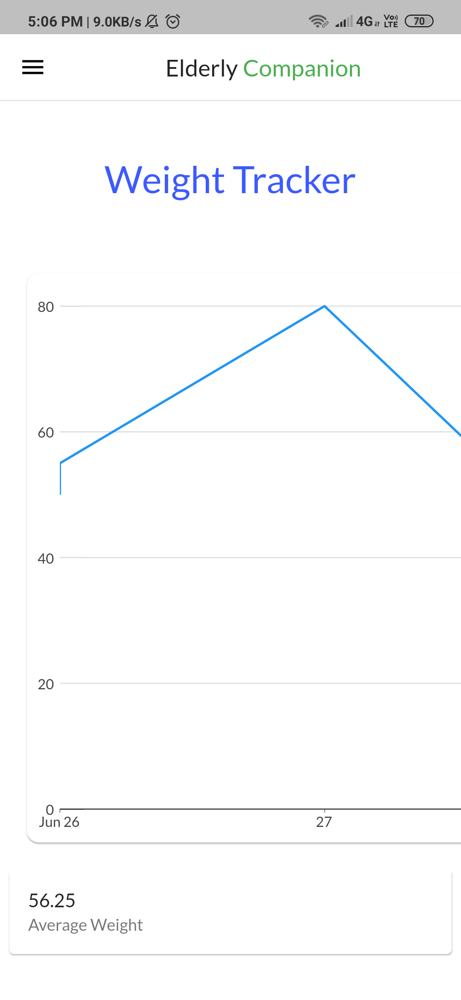

# Elderly Companion

Companion app for [Elderly Care](https://github.com/adarshbalu/elderly_app) app.

## Download the App

## About

App has access to view documents added by the elder, to track the elder's medical vitals, let's the companion to video chat the elder.

## Features

- Tracker
  - This feature helps the person to track progress the elder's important health vitals such as sleep, weight, blood pressure, sugar level etc.   - A graphical representation of each would be provided based on the regular data.

- Document Storage
  - Helps in viewing all personal documents of the elder  - from all personal IDs and journals to medical contacts and insurance informations. 
  
 - Video Call
  - Helps care taker to video chat with elder anytime. Call can be initiated from both ends.
## Screenshots

### Home Screen

### Documents

### Video call

### Tracker

## Permissions

On Android versions prior to Android 6.0, Elderly Companion requires the following permissions:

- Full Network Access: It uses the network data for the firebase.

## Contributing

Elderly Companion app is a free and open source project. Any contributions are welcome. Here are a few ways you can help:
 * [Report bugs and make suggestions.](https://github.com/adarshbalu/elderly_companion/issues)
 

## License

This application is released under GNU GPLv3 (see [LICENSE](LICENSE)).
Some of the used libraries are released under different licenses.
